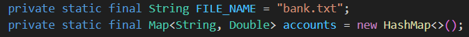
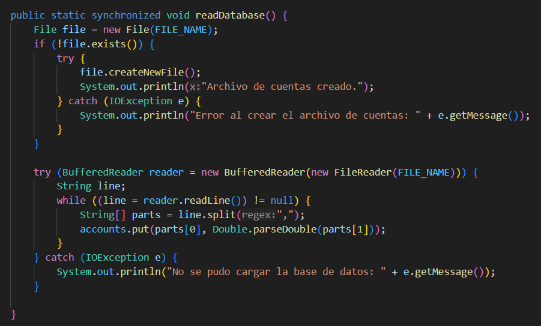
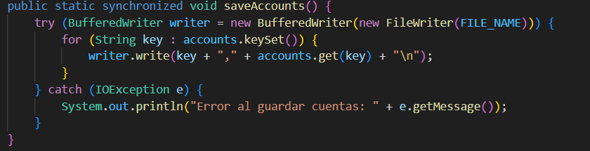
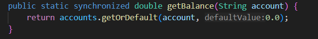
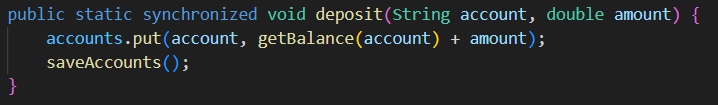
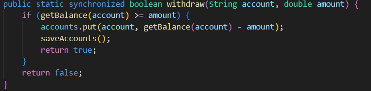

## Clase BankDatabase

_La clase BankDatabase simula una base de datos de cuentas bancarias utilizando un archivo de texto (bank.txt) para almacenar la información de las cuentas y sus respectivos saldos._

### Atributos
- FILE_NAME: Nombre del archivo donde se almacenan los datos de las cuentas.
- accounts: Map estático que almacena los números de cuenta y sus respectivos saldos.
- SERVER_PORT: Puerto del servidor, definido como 8082.

### Métodos

- **readDatabase()**
Carga las cuentas desde el archivo bank.txt en la memoria.

-	Funcionamiento: 
1.	Si el archivo no existe, se crea uno nuevo.
2.	Lee cada línea del archivo y extrae el número de cuenta y saldo.
3.	Almacena estos valores en el Map accounts.
4.	**Sincronización:** synchronized, para evitar accesos simultáneos inconsistentes.
5.	**Manejo de errores:** Captura excepciones de I/O y muestra mensajes de error en la consola.

- **saveAccounts()**
Guarda los datos del Map accounts en el archivo bank.txt.

-	Funcionamiento: 
1.	Escribe cada cuenta y su saldo en una nueva línea del archivo.
2.	**Sincronización:** synchronized, para evitar accesos simultáneos inconsistentes.
3.	**Manejo de errores:** Captura excepciones de I/O y muestra mensajes de error en la consola.

- **getBalance(String account)**
Obtiene el saldo de una cuenta específica.

-	Funcionamiento: 
1.	Verifica si la cuenta existe en el Map accounts.
2.	Si la cuenta no existe, devuelve un saldo de 0.0.
3.	**Sincronización:** synchronized, para evitar accesos simultáneos inconsistentes.

- **deposit(String account, double amount)**
Agrega una cantidad de dinero a la cuenta especificada.

-	Funcionamiento: 
1.	Obtiene el saldo actual de la cuenta.
2.	Suma el monto depositado al saldo existente.
3.	Guarda los cambios en el archivo.
4.	**Sincronización:** synchronized para evitar problemas de concurrencia.

- **withdraw(String account, double amount)**
Retira dinero de una cuenta si hay fondos suficientes.

-	Funcionamiento: 
1.	Verifica si la cuenta tiene saldo suficiente.
2.	Si tiene saldo suficiente, descuenta el monto y guarda los cambios.
3.	Retorna true si la operación se realizó con éxito, false en caso contrario.
4.	**Sincronización:** synchronized para evitar problemas de concurrencia.

---
- Regresar _**Manual del programa**_ [<<**aquí**>>](./MANUAL_PROGRAMA.md) 