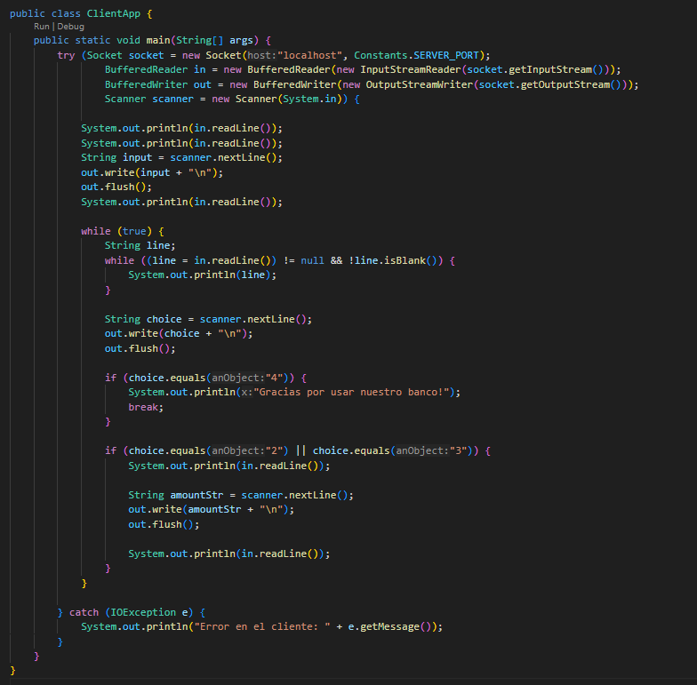

## Clase ClientApp

_La clase ClientApp se conecta al servidor bancario y permite a los usuarios interactuar con el servidor para realizar operaciones bancarias._

-  Se crea un socket para conectarse al servidor en localhost y el puerto definido en Constants.SERVER_PORT.
-  BufferedReader y BufferedWriter manejan la comunicación entre cliente y servidor.

**Comunicación Inicial:**
- Se recibe un mensaje de bienvenida y una solicitud para ingresar el número de cuenta.
- El número de cuenta ingresado por el usuario se envía al servidor.

**Bucle Principal:**
El cliente opera en un bucle que permite al usuario interactuar continuamente con el servidor.

1. Se reciben las líneas del menú enviadas por el servidor y se muestran al usuario.
2. El cliente captura la opción elegida por el usuario y la envía al servidor.
3. Si el usuario selecciona la opción "4", el cliente muestra un mensaje de despedida y cierra la conexión.
4. El cliente recibe una solicitud de monto desde el servidor.
5. El monto ingresado por el usuario se envía al servidor.
6. La respuesta del servidor (éxito o error) se muestra en la consola.
7.	**Manejo de errores:** Captura excepciones de I/O y muestra mensajes de error en la consola.

---
- Regresar _**Manual del programa**_ [<<**aquí**>>](./MANUAL_PROGRAMA.md) 