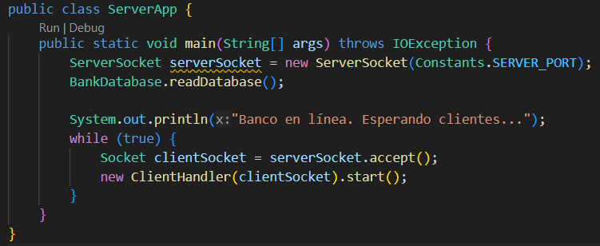
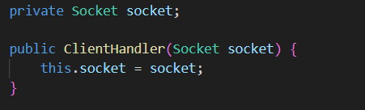
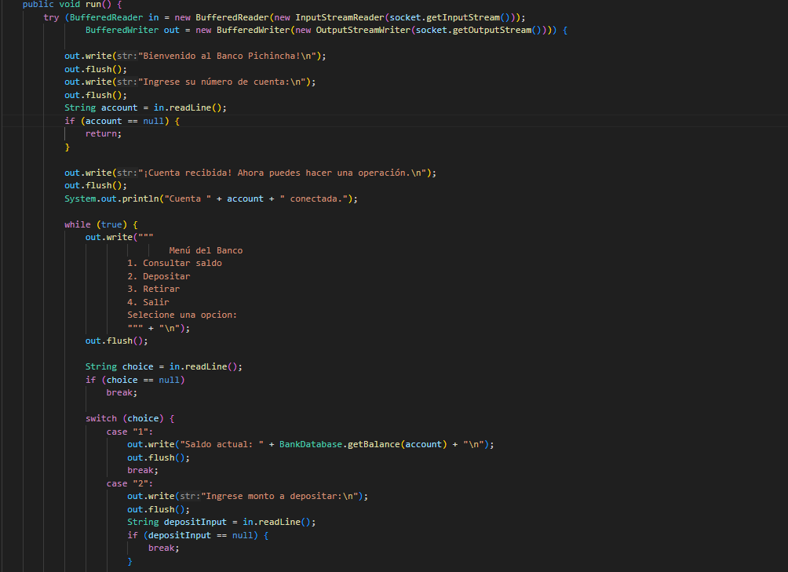
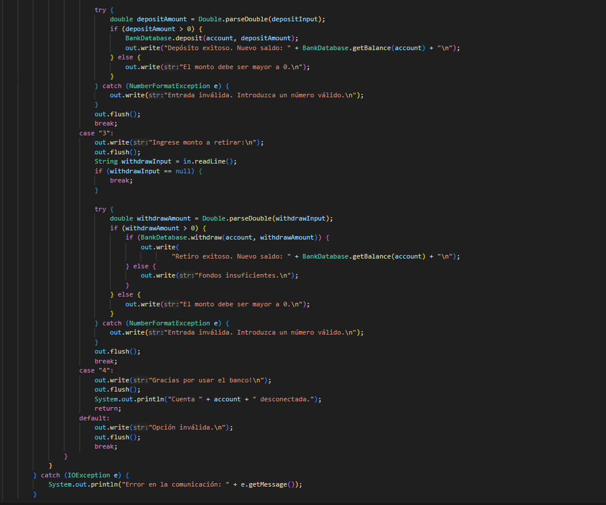

## Clase ServerApp

_La clase ServerApp administra las cuentas bancarias.
Recibe conexiones de clientes y maneja múltiples sesiones simultáneamente con hilos._

## HILO

#### ClientHandler
La clase ClientHandler maneja la comunicación entre un cliente y el servidor bancario mediante sockets. Se ejecuta en un hilo separado para cada cliente conectado.

### Atributos
- socket: Objeto Socket que representa la conexión del cliente.

### Métodos
- **run()**
Maneja la comunicación con el cliente, procesando sus solicitudes de operaciones bancarias.

-	Funcionamiento: 
1.	Envía un mensaje de bienvenida y solicita el número de cuenta.
2.	Muestra un menú con las opciones: consultar saldo, depositar, retirar y salir.
3.	Procesa la opción seleccionada por el usuario.
4.	Utiliza BankDatabase para gestionar las transacciones de la cuenta.
5.	Maneja errores y valida las entradas del usuario.
6.	Si el cliente elige salir, cierra la conexión y finaliza el hilo.

- 	Manejo de errores:
1.	Captura excepciones de IOException en caso de problemas de comunicación.
2.	Maneja errores en la conversión de valores numéricos.
3.	Valida que los montos de depósito y retiro sean mayores que cero.
4.	Verifica que el saldo sea suficiente antes de realizar un retiro.

---
- Regresar _**Manual del programa**_ [<<**aquí**>>](./MANUAL_PROGRAMA.md) 