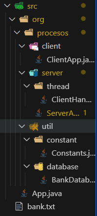

# Documentación del programa

# AppClientServer-BankSimulator
_Bank simulator, es un simulador que trabaja con sockets he hilos para resolver tareas en paralelo, específicamente el flujo de información entre la gestión de cuentas de un banco, la información necesaria se guarda y se obtiene de un ficherto .txt._

---
## ESTRUCTURA DEL CÓDIGO
El código fuente del proyecto está organizado de la siguiente manera:

---
### CLASES UTILARIAS
- Encuentra la clase _**BankDatabase**_ [<<**aquí**>>](CLASE_BANK_DATABASE.md)

### SERVIDOR
- Encuentra la clase _**ServerApp**_ [<<**aquí**>>](CLASE_SERVER.md) 

### CLIENTE
- Encuentra la clase _**ClientApp**_ [<<**aquí**>>](CLASE_CLIENT.md) 